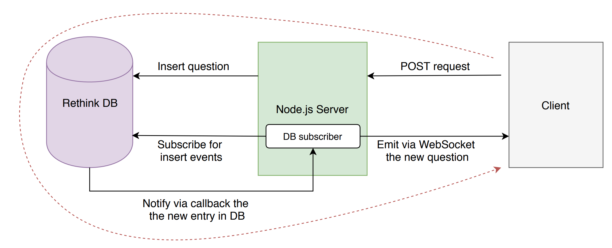
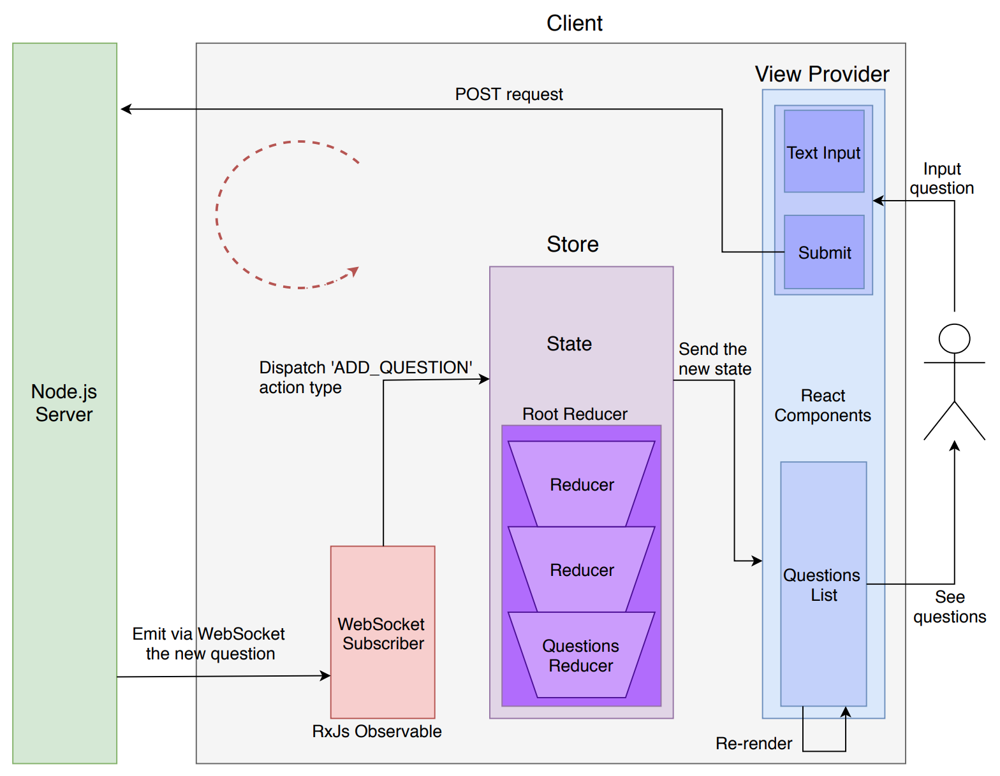

# Askify

[](https://circleci.com/gh/alexsomai/askify/tree/master)

## About

A question based real-time web application made with React, Redux, Express and RethinkDB. 🙋🏻‍♂️

## Demo
[](https://vimeo.com/385663525 "Askify demo (click to watch)")

## Application Architecture

### Overall Architecture


### Client Side Architecture


## Installation

**Step 1.** [Install RethinkDB](https://www.rethinkdb.com/docs/install/).  
**Step 2.** Install [Node.js](https://nodejs.org/) v8 (or newer).

## Start locally

**Step 1.** [Start RethinkDB](https://www.rethinkdb.com/docs/start-a-server/):

```shell
$ rethinkdb
```

**Step 2.** Clone this repository:

```shell
$ git clone git@github.com:alexsomai/askify.git
$ cd askify
```

**Step 3.** Start the server application.

&nbsp;&nbsp;&nbsp;&nbsp;**Step 3.1.** Install dependencies:

```shell
$ cd server && npm install
```

&nbsp;&nbsp;&nbsp;&nbsp;**Step 3.2.** Start the server:

```shell
$ cd server && npm start
...
==> 🌎  Server Listening on port 3001. Open up http://localhost:3001/ in your browser.
```

**Step 4.** Start the client application.

&nbsp;&nbsp;&nbsp;&nbsp;**Step 4.1.** Install dependencies:

```shell
$ npm install
```

&nbsp;&nbsp;&nbsp;&nbsp;**Step 4.2.** Start the client:

```shell
$ npm start
...
==> 🌎  Listening on port 3000. Open up http://localhost:3000/ in your browser.
```

**Step 5.** Open the application.

Access http://localhost:3000/ in your browser, and enjoy 🙂.
